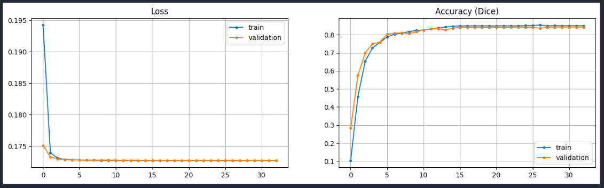

# Semantic segmentation task (airbus ship detection challenge)

### Semantic segmentation task to identify ships by photos taken from a satellite

## **Table of contents** 

1. [Introduction](#)
    * [Project's objective](#)
    * [The environment used](#)
        * [Limitations](#)
    * [Choice behind the framework](#)
        * [Tensorflow](#)
        * [PyTorch](#)
        * [Chosen framework](#)
    * [Technologies used](#)
2. [Data description](#)
3. [Data visualization](#)
    * [Consistency in image sizes](#)
    * [RLE decoding](#)
    * [Class imbalance](#)
4. [Data preprocessing](#)
    * [Repeatability of `ImageId`s](#)
    * [Handling `NaN`s](#)
5. [Data cleaning](#)
6. [Model selection](#)
7. [Metrics choice](#)
8. [Loss function choice](#)
9. [Optimizer choice](#)
10. [Data representation](#)
11. [Implementation strategy (PyTorch)](#)
    * [The class imbalance problem](#)
12. [Initial guesses](#)
    * [Learning rate](#)
    * [Number of epochs](#)
    * [Batch size](#)
    * [Learning rate scheduler](#)
    * [Image shape](#)
    * [Augmentations](#)
13. [Model training](#)
    * [`ZERO_SHIPS_RATIO_PER_BATCH`](#)
    * [Loss function](#)
    * [Learning rate](#)
    * [Batch size](#)
    * [Augmentations](#)
    * [Learning rate scheduler](#)
14. [Model testing](#)
    * [Choosing threshold](#)
    * [Conclusions](#)
15. [Improvements](#)
    1. [Improvement 1st](#)
        * [Results](#)
        * [Choosing threshold](#)
        * [Conclusions](#)
    2. [Improvement 2nd](#)
    3. [Improvement 3rd](#)
    4. [Conclusion](#)
16. [Project files' description](#)
17. [Short models' reference](#)
18. [About author](#)
19. [References](#references)

## Introduction
The task is given by `WINSTARS.AI` company. It states:
> The goal of the test project is to build a semantic segmentation model. Prefered tools and notes: tf.keras, Unet architecture for neural network, dice score, python.
>
> Results of your work should [contain](#project-files-description) next:
>
> - link to GitHub repository with all source codes;
> - code for model training and model inference should be separated into
different .py files;
> - readme.md file with complete description of solution;
> - requirements.txt with required python modules;
> - jupyter notebook with exploratory data analysis of the dataset;
> - any other things used during the working with task;
>
> Source code should be well readable and commented;
>
> Project has to be easy to deploy for testing.

### Project's objective
The objective of the project is to build a semantic segmentation model using Python, optionally including the suggested technologies, while maximizing `Dice` and separating different project modules into different files.

### The environment used
The problem being researched is a Kaggle competition with a vast amount of images. The decision of using the Kaggle environment was made due to its simplicity, convenience and speed (at the time of selection).

#### Limitations
We are limited in terms of GPU by 30 hours per week by the Kaggle platform. Additionally, the system tends to terminate long-run sessions (multiple-epoch trainings) or freezes when the tab is inactive. It restrics the RAM usage as well, meaning the high resolution images or large batch sizes would not be able to be processed either.

### Choice behind the framework
The most popular frameworks for Data Science and Machine Learning are the two prominent options: `TensorFlow` and `PyTorch`. While both frameworks continue to evolve, each possesses its own set of advantages and disadvantages.

#### Tensorflow
Having had an experience in both frameworks while learning, `Tensorflow` has often encountered challenges in ensuring reproducibility (at least on CUDA). Additionally, implementing changes at various stages proved to be harder to implement, less intuitive and user-friendly compared to `PyTorch`'s.

It is considered, however, that `Tensorflow` fits production and scalable projects more; moreover, it is preferred for models' deployment on mobile devices and has a larger community due to being older than `PyTorch`.

#### PyTorch
On the contrary, `PyTorch` is more suitable for flexibility and research, utilizing the same functionality within multiple projects and have a complete reproducability, which is crucial for any Machine Learning project (for instance when determining a single augmentation to be applied, we would need to perform only one training). There is also a plethora of native features that `PyTorch` provides and `Tensorflow` doesn't: various loss functions, optimizers with complicated set-ups and metrics, data loaders and custom samplers within their native OOP mechanics.

#### Chosen framework
Given the preference for exploring new ideas and ensuring reproducibility on GPU; being a student, researcher, constantly trying new ideas, I have given my preference to `PyTorch`. (`Tensorflow` does have reproducability on Cuda in the experimental module, but it leads to slowing the process down and makes it indiscernible from CPU operations in terms of model training, making it meaningless to utilize parallel evaluations as such).

---
`P.S.:` My perception is limited and biased, I was taught this way and inherited not only knowledge, but the spirit of my teacher whom I sincerely adore. However, I have tried implementing the project utilizing `Tensorflow` and `Keras` first and gave up after I lost control of the reproducability having switched to GPU. Training results in Tensorflow were also worse (I assume the scores were a matter of my mistakes).

### Technologies used
All of the instruments used are popular and well-known. I suggest we look at them as a code for convenience:

```
import os                       # interacting with the operating system
import sys                      # interacting with the Python interpreter
import pandas as pd             # For data manipulation and analysis
import numpy as np              # For numerical computing
import gc                       # For garbage collection
import random                   # For generating random numbers

import cv2                      # For computer vision tasks
from PIL import Image           # For image processing
import albumentations as albu   # For image augmentation

import matplotlib.pyplot as plt # For plotting
from sklearn.model_selection import train_test_split  # For splitting data into train and test sets

import torch                    # PyTorch library
import torch.nn as nn           # PyTorch's neural network module
import torch.optim as optim     # For optimization algorithms
from segmentation_models_pytorch import utils  # Utilities for segmentation models
import segmentation_models_pytorch as smp  # PyTorch segmentation models
from torch.utils.data import Dataset, DataLoader  # For creating custom datasets and data loaders
from tqdm import tqdm  # For displaying progress bars during loops
```
Seen above libraries can be separated into 4 groups:  
- frequently-used Python modules of general usage
- working with images (including plotting and augmenting)
- plotting and separating data
- a regular set of `PyTorch` modules


## Data description
The data is a set of ship images taken from a satellite. They are represented via a `.csv` file and the respective images. Its columns are:
- ImageId - represents the name of the image with the `.jpg` extension
- EncodedPixels - RLE encoded mask for the respective image
- Ships (custom) - how many ships is present on the image
- Size_kb (custom) - image size in kb


## Data visualization
Before proceeding to working with the dataset, we should look at it and obtain some basic information. Issues having been addressed:


### Consistency in image sizes

Taking the first image for an initial guess, we check if others have the same dimensions. It is confirmed that all images are indeed `(768, 768)`.


### RLE decoding

Each first number in the mask represents the pixel number and each second - the quantity of filled pixels after. A custom function was implemented according to the above explanation.


### Class imbalance

We can look at the problem as:
- a ratio of single-ship images to numerous-ship images
- a ratio of non-ship images to images with ships. 

Both hypothesis were addressed empirically ([simple](#model-training) and [improved](#improvement-1st) models respectively).

## Data preprocessing
### Repeatability of `ImageId`s

By printing unique `ImageId`s within the dataframe, the observation has proved that a significant part of ids is repeated. That is because the mask describes only one ship per line in the `.csv`, so the images were grouped, concatenating masks accordingly.

### Handling `NaN`s

As representations of an empty mask is a plain `0`, we have replaced `Nan`s with the latter.


## Data cleaning
The problem: corrupted / invalid / error-read / out-of-topic images.

A complex problem. I have inspected images within my file system and noticed that sometimes they are exclusively clouds, lands or simply noise (blue squares). I have sorted them out by image size and, emperically, most of them were in the files of less or equal to 52 kb.

With nearly 200 000 images, manually inspecting each picture is not feasible. We would need to use other classifying algorithms for that presumably. Despite of that, I came across a solution by a researcher on Kaggle (`ABNERZHANG`), who had previously dealt with the problem and [provided](#https://www.kaggle.com/c/airbus-ship-detection/discussion/62921) his results on the platform for everyone. It would be a shame not to have respected his efforts.


## Model selection
The suggested `Unet` model is indeed popular and suitable for this type of tasks. It similarly aligns with the [limitations](#limitations) listed by the number of trainable parameters (depending on the specific architecture).


## Metrics choice
The `IoU` is often utilized  due to its ease of understanding to a human eye in terms of assessing a model's performance. Nonetheless, the suggested `Dice` is an option with a higher ephasis on intersection, rather than both intersection and difference equally, as with `IoU`. Given the serious class [imbalance](#the-class-imbalance-problem) problem, where it is critical to identify objects and avoid mistakes, `Dice` would give higher scores here, so the metric is indeed suits better. Thus, `Dice` it is.


## Loss function choice
As we are dealing with the task of maximizing `Dice`, we want to make sure to minimize the `Dice error` loss. It was picked as a "counterforce" to maximize the metric. So it is the first on the list. However, it is always "a matter of model complexity and data combination", so we will try all commonly used loss functions for the current scenario:
- Focal loss - Cross Entropy based loss function; designed to address class imbalance and focuses on hard examples during training (matches our case accurately)
- Lovasz loss - suits binary problem; designed to optimize for the intersection over union (`IoU`) metric (unlikely to work as our metric is `Dice`)
- Binary Cross Entropy with Logits Loss - Cross Entropy based; suits binary problem; designed for binary classification tasks


## Optimizer choice
`Adam`, as a state-of-art optimizer, fits almost in any case: adaptive learning rate, efficiency, low memory requirements, ease of use. These are on the list unless they are needed:
- `Adam`
- SGD
- RMSProp 
- Adagrad 
- modifications of aboves


## Data representation
A single item within the dataset is represented as follows:
- Encoded RGB image (batch size, color channel=`3`, width, height)
- Decoded grayscale mask (batch size, color channel=`1`, width, height)

The image is represented as a `3` color channel array `[0; 255]`. The mask, which is single-channeled, is either `0` (for an empty mask, i.e. no ships on the image) or an image-sized array filled with `0` and `1`, where `0` represents a non-ship pixel, `1` - a ship pixel.


## Implementation strategy (PyTorch)
We will have a custom class for training, visualization and debugging the model called `TrainAndTestModel`. Mostly used are its methods `train` and `continue_training`, names of which speak for themselves. The second one can be utilized if the training is terminated in any moment without the necessity of starting over. 

For these we will have to create a `DataLoader` that creates batches of data.

And for the `DataLoader` to work, we will need a custom dataset class that I have titled `AirbusShipDetectionDataset`, specifically its `__getitem__` method that will be utilized by the `DataLoader`. It represents [a single item](#data-representation) of a dataset.


### The class imbalance problem
Besides that, we have an additional task to address - class imbalance, according to which the decision to create a custom sampler has been made. It is utilized by the `DataLoader` and called `ShipStratifiedSampler`. Due to the strong class imbalance, I have undersampled images with no ships, but don't have enough certainty that it will help the model. That is why I have created a sampler that takes a tunable parameter `zero_ships_ratio_per_batch` for the ratio of empty images per batch. It would [answer](#model-training) this question once and for all.


## Initial guesses


### Learning rate
It tends to be low for segmentation problems, but still varies from case to case, so `1e-4` is chosen as an initial guess.


### Number of epochs
Depends on data complexity. It is mostly `5` in the project for a representative plot while tuning the model. Later, we run more epochs, often `5` each time so that we can detect an overfit earlier and save the best state of the model.


### Batch size
A good practice is to pick odd numbers to avoid patterns/seasonalities (this is not the case here). Adjusted to 16 during experimentation due to a slight overfit.


### Learning rate scheduler
Segmentation tasks often utilizes the `ReduceLROnPlateau` to fine-tune the model, when the score at its peak and we are looking for a better-fit local minimum with extremely small (and/or different) steps to avoid overshooting and get a better understanding of the surface area of the function we're minimizing. For time-saving purposes it was also applied at the end.


### Image shape
Due to the Kaggle's [restrictions](#limitations), images being researched were downscaled to `(256,256)`.


### Augmentations
They are applied as a matter of regularization for the model in case of overfit or to provide more diversity to an existing dataset by altering the appearance of some images. Initially (and later on), the following augmentations are used:

```
albu.Compose([
    albu.Resize(*INPUT_SIZE),   # resize to (256,256)
    albu.Normalize(),           # normalizes the dataset according to the imagenet's mean and std
            ])
```


## Model training
A popular `resnet18` `Unet` modification is chosen and its complexity has been researched. It may be simplified / complexed in [2nd](#improvement-2nd) or [3rd](#improvement-3rd) modification.


### ZERO_SHIPS_RATIO_PER_BATCH
The very first parameter we want to get along with. I have considered undersampling of non-ship images. Firstly, we research the impact of the amount of non-ship images on the model's performance. Initial guess is `0.25` per batch of `16`:

$
16 * 0.25 = 4
$
images.

The best `Dice`:`Loss` here is `0.474`:`0.989`. Looking at the `ZERO_SHIPS_RATIO_PER_BATCH` <u>de</u>creasing, we start to see the <u>in</u>crease in metrics:

|   ZERO_SHIPS_RATIO_PER_BATCH    |   Dice   |  Loss    |
|---------------------------------|----------|----------|
|               0.25              |  0.474   |  0.989   |
|               0.15              |  0.490   |  0.987   |
|               0.10              |  0.537   |  0.986   |
|               0.00              |  0.539   |  0.985   |


The best model's performance; plotted:


The optimal value `ZERO_SHIPS_RATIO_PER_BATCH`= `0.0`.

### Loss function
The next issue to address is an issue of a high loss. Proceeding to try [different](#loss-function-choice) losses:

|   Loss function    |   Dice   |  Loss    |
|--------------------|----------|----------|
|   Dice loss              |  0.539   |  0.985   |
|   Focal loss             |  0.759   |  0.172   |
|   Lovasz loss            |  0.001   |  1.000   |
|   BCEWithLogits loss     |  0.821   |  0.691   |


Both `Focal` and `BCEWithLogits` losses look well, but based on the [metric](#metrics-choice) being optimized, the one with the lower loss is chosen.

The best model's performance; plotted:


### Learning rate
The plot looks stunning to me, the learning rate remained untouched (`1e-4`).


### Batch size
The batch size of `16` seems to be perfectly in tact with the [model](#model-selection)'s complexity and the [learning rate](#learning-rate). To make sure we have the best possible performance at this stage, the batch size has been researched too:

|   Batch size    |   Dice   |  Loss    |
|--------------------|----------|----------|
|   9             |  0.762   |  0.172   |
|   16             |  0.759   |  0.172   |
|   25            |  0.739   |  0.172   |


The batch size remained untouched due to the fact that a batch size of `9` creates more batches, consumes more time and according to the plot, overfits early:


### Augmentations
It is hard to imagine a computer vision task without augmentations. The list of tried augmentations and their combinations:

```
albu.RandomRotate90(p=0.5),
albu.HorizontalFlip(p=0.5),
albu.VerticalFlip(p=0.5),
albu.ShiftScaleRotate(shift_limit=0.1, scale_limit=0.2, rotate_limit=45, p=0.5), 
albu.RandomBrightnessContrast(p=0.5),
albu.GaussianBlur(blur_limit=(3, 5), p=.5),
albu.ElasticTransform(p=0.5, alpha=120, sigma=120 * 0.05, alpha_affine=120 * 0.03),
albu.GaussNoise(var_limit=(10.0, 20.0), p=.5),
albu.Cutout(num_holes=1, max_h_size=16, max_w_size=16, p=.5), 
albu.ColorJitter(brightness=0.1, contrast=0.1, saturation=0.1, hue=0.2, p=.5), 
albu.GridDistortion(p=0.5),
albu.OpticalDistortion(distort_limit=0.5, shift_limit=0.5, p=0.5),
```

None of them or their combinations has worked. I presume the conclusion behind this is the data's being wholesome and diverse. It combines beautifully with the model's complexity. This is also the reason why we don't consider simplifying or complexing the `resnet18` to anything else.


### Learning rate scheduler
It is high time we maximized the score having tuned the parameters. I have summarized the trainings performed:

|Model 1 (part 1)|               |                |                |                |            
|------|----------------|----------------|----------------|----------------|
| learning rate  | 1e-4 | 1e-5           | 1e-5           | 1e-10          |
| batch size  | 16      | 16             | 16             | 16             |
| epochs   | 5          | 5              | 5              | 1              |
| augs | norm + reshape | norm + reshape | norm + reshape | norm + reshape |
| optim| Adam           | Adam           | Adam           | Adam           |
| dice | 0.75926        | 0.81629        | 0.83660        | 0.841535       |
| loss | 0.17284        | 0.17279        | 0.17277        | 0.172753       |
| shape| 256x256        | 256x256        | 256x256        | 256x256        |
| scheduler| -          | redLROnPlat(max,0.1,1)| redLROnPlat(max,0.1,1)| redLROnPlat(max,0.1,1)|


|Model 1 (part 2)|      |                |                |                |            
|------|----------------|----------------|----------------|----------------|
| learning rate | 1e-10 | 1e-10          | 1e-10          | 1e-10          |
| batch size  | 16      | 16             | 16             | 16             |
| epochs   | 1          | 1              | 1              | 1              |
| augs | norm + reshape | norm + reshape | norm + reshape | norm + reshape |
| optim| Adam           | Adam           | Adam           | Adam           |
| dice | 0.841536       | 0.841536       | 0.841536       | 0.841536       |
| loss | 0.172753       | 0.172753       | 0.172753       | 0.172753       |
| shape| 256x256        | 256x256        | 256x256        | 256x256        |
| scheduler| redLROnPlat(max,0.1,1)      | redLROnPlat(max,0.1,1)| redLROnPlat(max,0.1,1)| redLROnPlat(max,0.1,1)|


|Model 1 (part 3)|      |                |                |                |     |        
|------|----------------|----------------|----------------|----------------|-----|
| learning rate | 1e-9  | 1e-8           | 1e-7           | 1e-8           | 1e-9|
| batch size  | 16      | 16             | 16             | 16             | 16 |
| epochs   | 1          | 1              | 2              | 1              | 1 |
| augs | norm + reshape | norm + reshape | norm + reshape | norm + reshape | norm+reshape |
| optim| Adam           | Adam           | Adam           | Adam           | Adam |
| dice | 0.841539       | 0.841661       | 0.84222        | 0.84252        | 0.84251 |
| loss | 0.172753       | 0.172753       | 0.17274        | 0.17275        | 0.17275 |
| shape| 256x256        | 256x256        | 256x256        | 256x256        | 256x256 |
| scheduler| redLROnPlat(max,0.1,1)      | redLROnPlat(max,0.1,1)| redLROnPlat(max,0.1,1)| redLROnPlat(max,0.1,1)|redLROnPlat(max,0.1,1)|


The best `Dice`:`Loss` combination is `0.84251`:`0.17275`:



## Model testing
For the testing, I have picked `9` unseen images (from the validation data) and divided them into `3` groups: `no`-ship images, `single`-ship images and `multiple`-ship images. 


### Choosing threshold
The model has shown its best performance with the threshold of `1e-2`, but has problems with identifying multiple ships. The model with lower thresholds results in a lot of noise in simpler cases while doing better fixating multiple ships (the trade-off is not worthy).

`Threshold` = `1e-5` (noisy):


`Threshold` = `1e-2` (optimal):


## Conclusions
1. The model has no problem identifying that an image has no ships on it. No wonder that the [`ZERO_SHIPS_RATIO_PER_BATCH`](#zero_ships_ratio_per_batch) was the best at its value of `0`.
2. The value of `THRESHOLD` = `1e-2` is an optimal choice. Values below it will result in noise (false positives) on pictures with fewer or no ships, above it - in bad-quality multiple ships predictions (it "thinks" there are fewer). The model is struggling with numerous ships.

## Improvements

### Improvement 1st
Thinking of how numerous ships are the problem, I have come up with a solution of stratification by the amount of ships. The class of the custom sampler was changed to `ShipStratifiedSampler` and now takes a `multiple_ships_ratio_per_batch` parameter that is responsible for a multiple ships amount per batch.

During the training, most of the latter training structure was preserved and the `multiple_ships_ratio_per_batch` coefficient was evaluated as follows:

$
21445 + 12217 = 33662
$
images for training

$
33662 // 16 = 2103
$
batches

Having
$
21445 // (16 * (1 - x)), 
$
solve x ->

$
x = 0.3629
$
to avoid samples` repetition as much.

#### Results
The best `Dice`:`Loss` pair was `0.84761`:`0.17276`.

`Threshold` = `1e-2` (underfit):


`Threshold` = `4e-4` (optimal):


#### Choosing threshold
The option of `4e-4` has appeared to be the most optimal.


#### Conclusion
The second model results in identifying multiple ships more accurately, but more biased towards fewer-ship predictions. I have intentionally picked a slightly more overfit version (in terms of epochs) to address the issue of noise.

I have summarized the trainings performed:

|Model 2 (part 1)|               |                |                |                |            
|------|----------------|----------------|----------------|----------------|
| learning rate  | 1e-4 | 1e-5           | 1e-5           | 1e-10          |
| batch size  | 16      | 16             | 16             | 16             |
| epochs   | 5          | 5              | 5              | 5              |
| augs | norm + reshape | norm + reshape | norm + reshape | norm + reshape |
| optim| Adam           | Adam           | Adam           | Adam           |
| dice | 0.77497        | 0.82578        | 0.84657        | 0.84761        |
| loss | 0.17282        | 0.17277        | 0.17276        | 0.17276        |
| shape| 256x256        | 256x256        | 256x256        | 256x256        |
| scheduler| -          | redLROnPlat(max,0.1,1)| redLROnPlat(max,0.1,1)| redLROnPlat(max,0.1,1)|


|Model 2 (part 2)|               |                
|------|----------------|
| learning rate  | 1e-10|
| batch size  | 16      |
| epochs   | 5          |
| augs | norm + reshape |
| optim| Adam           |
| dice | 0.84761        |
| loss | 0.17276        |
| shape| 256x256        |
| scheduler| redLROnPlat(max,0.1,1)      |

### Improvement 2nd
As the model is struggling identifying numerous ships we can apply augmentations to only those and combine it with the [first modification](#improvement-1st). Therefore, we may implement two more tunable parameters: `multiple_ships_ratio_per_batch=0.3629` for controlling how many multiple-ship images will be per batch (no reason to pick less as we are decreasing the amount of training data; same risky to go further as we might overfit the model) and `ships_threshold_for_add_augs` for the amount of ships that should take additional augmentations.

### Improvement 3rd
As an option we could refuse of stratification completely as in the [first modification](#improvement-1st) and only try to adjust the `ships_threshold_for_add_augs`.

### Conclusion
As the modifications mentioned above are not within the scope of the project, they are left to the observer as a puzzle. As a matter of interest, I have tried to apply a few and it seems to me upon first inspection, that whenever the `dice` goes up, the `loss` goes up; whenever the `dice` goes down, the `loss` goes down. It is a problem of the `trade-off` of what we want to achieve. We may want to be extremely precise or avoid mistakes more. To hold both simultaneously, we could consider simplifying/complexing the model and tuning it again.

As the task has required to maximize `Dice`, [the second model](#improvement-1st) is chosen as a superior one and will be presented in the training file of the final project. Its training takes less time and code and it is more prune to [the class imbalance problem](#class-imbalance).

## Project files' description
- README.md - complete description of solution
- src - directory with images for the README.md
- requirements.txt - required python modules
- notebook.ipynb - initial notebook containing EDA + training + testing + developing + experimenting + thoughts
- EDA.ipynb - exploratory data analysis of the dataset + data preprocessing and cleaning
- train_ship_segmentation_post_EDA.csv - original .csv data representation after the EDA
- training.py - code for the [model](#improvement-1st) training (modification 1st)
- inference.py - code for the [model](#improvement-1st) inference
- models/model_1_simple_unet_semantic_segmentation.pt - saved [model](#model-testing) (simple; no modifications)
- models/model_2_sratified_unet_semantic_segmentation - saved [model](#improvement-1st) (modification 1st)

## Short models' reference:
|                                | Dice      | Loss      |   Best threshold                             | Application |
|--------------------------------|-----------|-----------|---------|----------------------------------------------|
| Model 1 (simple)              | 0.84251    | 0.17275    |   1e-2    | fewer ships   |
| Model 2 (stratified by ships) | 0.84761    | 0.17276    | 4e-4    | larger groups+ |

## About author
Project by Yurii Dzbanovskyi
* Email: [uradzb@ukr.net](mailto:uradzb@ukr.net)
* Telegram: [+38 096 874 17 18](https://t.me/@uradzb)

## References
1. https://www.kaggle.com/c/airbus-ship-detection/data
1. https://www.kaggle.com/c/airbus-ship-detection/discussion/62921
1. https://www.tensorflow.org/api_docs
1. https://pytorch.org/docs/stable/index.html
1. https://opencv.org/blog/pytorch-vs-tensorflow/#:~:text=Key%20Takeaways,for%20beginners%20and%20rapid%20prototyping.
1. https://www.freecodecamp.org/news/pytorch-vs-tensorflow-for-deep-learning-projects/
1. https://github.com/keras-team/keras/issues/7937
1. https://github.com/keras-team/keras/issues/15586